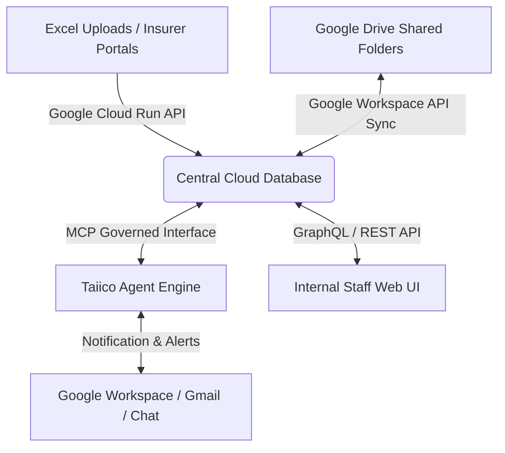
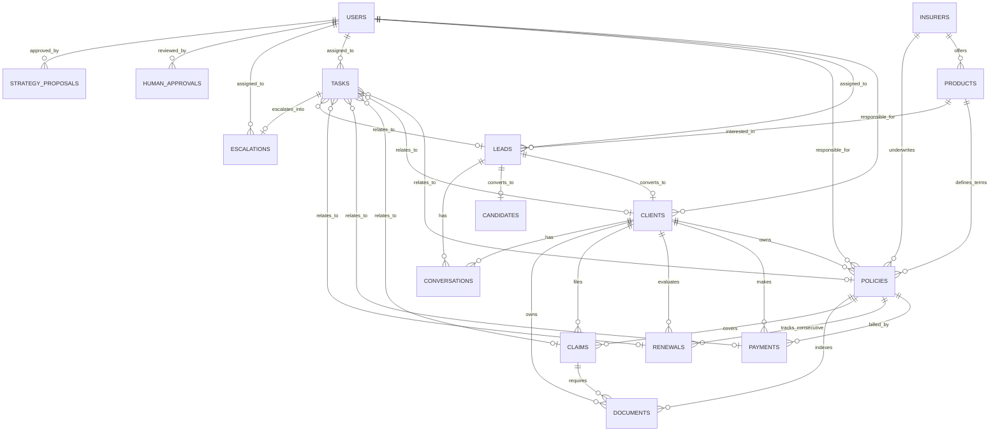

# Taiico Operational Architecture Specification v1.0

This document defines the structured, online-first architectural design of the **Taiico Operational Platform** (an AI-native insurance operating system). It serves as the single source of truth for the database schema, agent orchestration rules, event schemas, and human-in-the-loop workflows.

---

## 1. Cloud Architecture & Ingestion Design

### 1.1 Online-First vs. Legacy Local Excel
To resolve the key constraint of the legacy CRM (which required running the code locally on a single machine and accessing files directly via macOS CloudStorage directories), the new Taiico platform will operate **100% online in the cloud**.



- **Database Hosting**: Cloud SQL or AlloyDB (PostgreSQL 15+ compatible) acts as the centralized transaction ledger.
- **Document Store Integration**: Google Drive remains the primary operational document layer (holding actual policy PDFs, commission spreadsheets, and payment batches). The system indexes these documents in the database mapping their Google Drive IDs, making them available to both agents and human users.
- **Central API**: Running on Google Cloud Run, allowing secure, multi-tenant access from the web dashboard, webhook events, and the AI agent toolsets via the Model Context Protocol (MCP).

---

## 2. Entity-Relationship Model (Mermaid Diagram)

The following diagram defines the foreign key relationships and cardinalities across all Taiico operational objects.



---

## 3. Domain Primitive Dictionary

This directory formally documents the operational domain primitives of the platform.

### 3.1 Client
* **Description**: A person or entity with active/past policy relationships with Taiico. Sourced and synchronized from normalized CRM tables.
* **Owner Agent**: Lead Agent (upon conversion), Cobranza Agent (status/protection health), Internal Broker Agent (enrichment).
* **Fields**:
  * `id` (UUID, Primary Key)
  * `full_name` (VARCHAR, Not Null)
  * `email` (VARCHAR, Unique, Nullable)
  * `phone` (VARCHAR, Nullable)
  * `responsible_user_id` (UUID, Foreign Key -> `users`, Not Null)
  * `status` (VARCHAR, Not Null) — `'active'`, `'inactive'`
  * `communication_preference` (VARCHAR) — `'email'`, `'whatsapp'`, `'google_chat'`
  * `risk_profile` (VARCHAR) — `'low'`, `'medium'`, `'high'`
  * `metadata` (JSONB) — Relationships, notes, addresses, wallet summary.
  * `created_at` / `updated_at` (TIMESTAMP)
* **Approval Gates**: Deleting or changing client ownership requires human supervisor approval.

### 3.2 Lead
* **Description**: A commercial prospect (interested in buying a policy) or recruiter prospect (interested in joining as a prospectador/agent).
* **Owner Agent**: Sales Agent (commercial leads), Recruiter Agent (recruiting leads).
* **Fields**:
  * `id` (UUID, Primary Key)
  * `name` (VARCHAR, Not Null)
  * `phone` (VARCHAR, Nullable)
  * `email` (VARCHAR, Nullable)
  * `interest_type` (VARCHAR, Not Null) — `'policy'`, `'agent_recruitment'`, `'unknown'`
  * `product_id` (UUID, Foreign Key -> `products`, Nullable)
  * `source_channel` (VARCHAR) — `'website_form'`, `'referral'`, `'campaign'`
  * `urgency` (VARCHAR) — `'low'`, `'medium'`, `'high'`
  * `pipeline_stage` (VARCHAR, Not Null) — `'new'`, `'contacted'`, `'qualified'`, `'nurturing'`, `'unresponsive'`, `'converted'`, `'disqualified'`
  * `qualification_score` (NUMERIC, Default 0)
  * `assigned_user_id` (UUID, Foreign Key -> `users`, Nullable)
  * `metadata` (JSONB) — Chat interview summaries, specific needs.
  * `created_at` / `updated_at` (TIMESTAMP)
* **Approval Gates**: Converting to proposal or marking a high-value lead as disqualified requires human review.

### 3.3 Policy
* **Description**: The insurance contract registered inside Taiico. Acts as both a legal document index and an operational vehicle.
* **Owner Agent**: Internal Broker Agent (creation/enrichment), Renewal Agent (expiration tracking), Cobranza Agent (payment states).
* **Fields**:
  * `id` (UUID, Primary Key)
  * `policy_number` (VARCHAR, Not Null, Unique)
  * `client_id` (UUID, Foreign Key -> `clients`, Not Null)
  * `insurer_id` (VARCHAR, Foreign Key -> `insurers`, Not Null)
  * `product_id` (UUID, Foreign Key -> `products`, Not Null)
  * `effective_start_date` (DATE, Not Null)
  * `effective_end_date` (DATE, Not Null)
  * `status` (VARCHAR, Not Null) — `'in_force'`, `'lapsed'`, `'cancelled'`, `'renewed'`
  * `premium_amount` (NUMERIC, Not Null)
  * `payment_frequency` (VARCHAR, Not Null) — `'monthly'`, `'quarterly'`, `'semi_annual'`, `'annual'`
  * `responsible_user_id` (UUID, Foreign Key -> `users`, Not Null)
  * `document_link` (VARCHAR) — Google Drive File path / URL.
  * `commission_percentage` (NUMERIC, Not Null)
  * `metadata` (JSONB) — Beneficiaries, detailed coverage limits, exclusions.
  * `created_at` / `updated_at` (TIMESTAMP)
* **Approval Gates**: Manual status overrides, early cancellations, and deletion require senior manager approval.

### 3.4 Payment
* **Description**: Transactional payment tracking record mapped against policies. Populated from insurer batch uploads.
* **Owner Agent**: Cobranza Agent.
* **Fields**:
  * `id` (UUID, Primary Key)
  * `policy_id` (UUID, Foreign Key -> `policies`, Not Null)
  * `client_id` (UUID, Foreign Key -> `clients`, Not Null)
  * `expected_amount` (NUMERIC, Not Null)
  * `paid_amount` (NUMERIC, Default 0)
  * `due_date` (DATE, Not Null)
  * `received_date` (DATE, Nullable)
  * `status` (VARCHAR, Not Null) — `'expected'`, `'paid'`, `'missing'`, `'late'`, `'partial'`, `'unconfirmed_by_insurer'`, `'rejected'`
  * `source_file` (VARCHAR) — Excel ingestion filename.
  * `grace_period_deadline` (DATE, Not Null)
  * `cancellation_risk_level` (VARCHAR) — `'none'`, `'low'`, `'medium'`, `'high'`
  * `evidence_document_id` (UUID, Nullable) — Link to payment slip in `documents`.
  * `reconciliation_confidence` (NUMERIC, Default 1.0)
  * `notes` (TEXT)
  * `created_at` / `updated_at` (TIMESTAMP)
* **Approval Gates**: Manual confirmation of unconfirmed insurer payments; overriding missing payments.

### 3.5 Renewal
* **Description**: Process representing the consecutive generation of an expiring policy.
* **Owner Agent**: Renewal Agent.
* **Fields**:
  * `id` (UUID, Primary Key)
  * `original_policy_id` (UUID, Foreign Key -> `policies`, Not Null)
  * `client_id` (UUID, Foreign Key -> `clients`, Not Null)
  * `status` (VARCHAR, Not Null) — `'not_started'`, `'approaching'`, `'in_progress'`, `'awaiting_insurer'`, `'awaiting_client'`, `'modification_requested'`, `'renewed'`, `'not_renewed'`, `'cancelled'`
  * `renewal_deadline` (DATE, Not Null)
  * `renewal_quote_amount` (NUMERIC, Nullable)
  * `renewal_policy_id` (UUID, Foreign Key -> `policies`, Nullable)
  * `requested_modifications` (JSONB)
  * `insurer_response` (TEXT)
  * `client_decision` (VARCHAR) — `'accept'`, `'negotiate'`, `'reject'`
  * `risk_level` (VARCHAR) — `'none'`, `'low'`, `'medium'`, `'high'`
  * `created_at` / `updated_at` (TIMESTAMP)
* **Approval Gates**: Marking a policy renewal as failed/abandoned; submitting custom quotes with significant premium reductions.

### 3.6 Claim
* **Description**: Claim support tracking ticket. Excludes final underwriting (insurer's domain) but coordinates documents and status updates.
* **Owner Agent**: Claims Support Agent.
* **Fields**:
  * `id` (UUID, Primary Key)
  * `policy_id` (UUID, Foreign Key -> `policies`, Not Null)
  * `client_id` (UUID, Foreign Key -> `clients`, Not Null)
  * `claim_number` (VARCHAR, Nullable) — Insurer-assigned reference.
  * `status` (VARCHAR, Not Null) — `'opened'`, `'documents_requested'`, `'documents_uploaded'`, `'sent_to_insurer'`, `'insurer_requested_more_info'`, `'delayed'`, `'resolved'`, `'closed'`
  * `reported_date` (DATE, Not Null)
  * `resolution_date` (DATE, Nullable)
  * `escalation_level` (VARCHAR) — `'none'`, `'medium'`, `'high'`
  * `metadata` (JSONB) — Event type (medical, damage), description, insurer feedback.
  * `created_at` / `updated_at` (TIMESTAMP)
* **Approval Gates**: Closing high-value claims or escalating structural delays to executive team.

### 3.7 Document
* **Description**: Unified registry indexing files on Google Drive (SOPs, PDF policies, receipts, strategy reports).
* **Owner Agent**: Internal Broker Agent (indexing & parsing), Claims Agent/Cobranza Agent (evidence uploading).
* **Fields**:
  * `id` (UUID, Primary Key)
  * `google_drive_id` (VARCHAR, Unique, Not Null)
  * `name` (VARCHAR, Not Null)
  * `file_type` (VARCHAR, Not Null) — `'pdf'`, `'xlsx'`, `'docx'`, `'png'`
  * `category` (VARCHAR, Not Null) — `'policy_pdf'`, `'payment_evidence'`, `'claim_evidence'`, `'crm_export'`, `'sop'`, `'strategic_memo'`
  * `client_id` (UUID, Foreign Key -> `clients`, Nullable)
  * `policy_id` (UUID, Foreign Key -> `policies`, Nullable)
  * `claim_id` (UUID, Foreign Key -> `claims`, Nullable)
  * `status` (VARCHAR, Not Null) — `'uploaded'`, `'verified'`, `'rejected'`, `'missing'`
  * `uploaded_by` (VARCHAR, Not Null) — Agent or User identifier.
  * `drive_link` (VARCHAR, Not Null)
  * `metadata` (JSONB) — Extracted text, summary embeddings, parsing confidence.
  * `created_at` / `updated_at` (TIMESTAMP)
* **Approval Gates**: Rejecting a document due to bad quality or mismatches requires agent logs and user verification alerts.

### 3.8 Task
* **Description**: Actionable checklists generated by agents or human operators to organize manual processes.
* **Owner Agent**: Taiico Core (coordination & routing), Specialist Agents.
* **Fields**:
  * `id` (UUID, Primary Key)
  * `title` (VARCHAR, Not Null)
  * `description` (TEXT)
  * `status` (VARCHAR, Not Null) — `'pending'`, `'in_progress'`, `'completed'`, `'blocked'`, `'cancelled'`
  * `priority` (VARCHAR, Not Null) — `'low'`, `'medium'`, `'high'`, `'urgent'`
  * `assigned_agent` (VARCHAR) — Agent ID, if delegated.
  * `assigned_user_id` (UUID, Foreign Key -> `users`, Nullable)
  * `related_entity_type` (VARCHAR) — `'policy'`, `'client'`, `'payment'`, `'claim'`, `'renewal'`, `'lead'`
  * `related_entity_id` (UUID) — Foreign ID mapping based on type.
  * `due_date` (TIMESTAMP, Nullable)
  * `completed_at` (TIMESTAMP, Nullable)
  * `created_at` / `updated_at` (TIMESTAMP)
* **Approval Gates**: Bypassing overdue high-priority tasks.

### 3.9 Conversation
* **Description**: Multi-channel interactions (Gmail, WhatsApp, Chat) parsed for sentiment and historical summary.
* **Owner Agent**: Sales Agent, Recruiter Agent, Internal Broker.
* **Fields**:
  * `id` (UUID, Primary Key)
  * `client_id` (UUID, Foreign Key -> `clients`, Nullable)
  * `lead_id` (UUID, Foreign Key -> `leads`, Nullable)
  * `channel` (VARCHAR, Not Null) — `'whatsapp'`, `'email'`, `'chat'`, `'google_chat'`
  * `status` (VARCHAR, Not Null) — `'active'`, `'paused'`, `'closed'`, `'awaiting_human'`
  * `summary` (TEXT) — Contextual text digest.
  * `sentiment` (VARCHAR) — `'positive'`, `'neutral'`, `'anxious'`, `'frustrated'`
  * `transcript` (JSONB) — Message objects containing `{ sender, text, timestamp }`.
  * `last_message_at` (TIMESTAMP, Not Null)
  * `created_at` / `updated_at` (TIMESTAMP)
* **Approval Gates**: Transferring conversation to a live broker when client exhibits severe anxiety or complex legal questions.

### 3.10 AgentAction
* **Description**: Observability and audit logs tracking what AI agents do (database operations, browser actions).
* **Owner Agent**: Taiico Core.
* **Fields**:
  * `id` (UUID, Primary Key)
  * `agent_name` (VARCHAR, Not Null) — Agent that executed the action.
  * `action_type` (VARCHAR, Not Null) — `'db_query'`, `'email_draft'`, `'document_parse'`, `'browser_scrape'`
  * `status` (VARCHAR, Not Null) — `'started'`, `'completed'`, `'failed'`
  * `description` (TEXT)
  * `input_payload` (JSONB)
  * `output_payload` (JSONB)
  * `duration_ms` (INTEGER)
  * `created_at` (TIMESTAMP, Default now())
* **Approval Gates**: System logs are read-only and immutable.

### 3.11 Escalation
* **Description**: Explicit notification flags to humans when agents face sensitive or legally delicate cases.
* **Owner Agent**: Taiico Core.
* **Fields**:
  * `id` (UUID, Primary Key)
  * `task_id` (UUID, Foreign Key -> `tasks`, Nullable)
  * `agent_name` (VARCHAR, Not Null)
  * `title` (VARCHAR, Not Null)
  * `reason` (TEXT, Not Null)
  * `priority` (VARCHAR, Not Null) — `'medium'`, `'high'`, `'critical'`
  * `status` (VARCHAR, Not Null) — `'raised'`, `'assigned'`, `'resolved'`, `'dismissed'`
  * `assigned_user_id` (UUID, Foreign Key -> `users`, Not Null)
  * `related_entity_type` (VARCHAR)
  * `related_entity_id` (UUID)
  * `resolved_at` (TIMESTAMP, Nullable)
  * `created_at` / `updated_at` (TIMESTAMP)
* **Approval Gates**: Escalations can only be marked as resolved by a authorized human user.

### 3.12 HumanApproval
* **Description**: The human governance mechanism gating sensitive database updates or client outreach.
* **Owner Agent**: Taiico Core.
* **Fields**:
  * `id` (UUID, Primary Key)
  * `requested_by` (VARCHAR, Not Null) — Agent ID requesting action.
  * `action_name` (VARCHAR, Not Null) — `'cancel_policy'`, `'send_quote'`, `'override_payment'`
  * `description` (TEXT, Not Null)
  * `payload` (JSONB, Not Null) — Execution details upon approval.
  * `status` (VARCHAR, Not Null) — `'pending'`, `'approved'`, `'rejected'`
  * `reviewed_by` (UUID, Foreign Key -> `users`, Nullable)
  * `review_notes` (TEXT)
  * `reviewed_at` (TIMESTAMP, Nullable)
  * `created_at` (TIMESTAMP, Default now())
* **Approval Gates**: Self-approval is blocked. Only a designated human role can grant approval.

### 3.13 Insurer
* **Description**: Reference data for carriers (Metlife, Sura, Aarco).
* **Fields**:
  * `id` (VARCHAR, Primary Key) — `'metlife'`, `'sura'`, `'aarco'`, `'axa'`
  * `name` (VARCHAR, Not Null)
  * `portal_url` (VARCHAR)
  * `created_at` (TIMESTAMP)

### 3.14 Product
* **Description**: Specific lines of business and terms offered by Insurers.
* **Fields**:
  * `id` (UUID, Primary Key)
  * `insurer_id` (VARCHAR, Foreign Key -> `insurers`, Not Null)
  * `name` (VARCHAR, Not Null)
  * `branch` (VARCHAR, Not Null) — `'VIDA'`, `'GMM'`, `'AUTOS'`, `'DANOS'`
  * `created_at` (TIMESTAMP)

### 3.15 Candidate
* **Description**: Specialized pipeline tracking prospective prospectadores and insurance agents.
* **Owner Agent**: Recruiter Agent.
* **Fields**:
  * `id` (UUID, Primary Key)
  * `lead_id` (UUID, Foreign Key -> `leads`, Not Null)
  * `onboarding_status` (VARCHAR, Not Null) — `'not_started'`, `'in_progress'`, `'completed'`
  * `training_progress_pct` (NUMERIC, Default 0.0)
  * `has_credentials` (BOOLEAN, Default false)
  * `metadata` (JSONB) — Training checklist, credentials status, documents.
  * `created_at` / `updated_at` (TIMESTAMP)

### 3.16 StrategyProposal
* **Description**: Weekly memos, campaigns, and structural bottleneck suggestions written by Plauto Mind.
* **Owner Agent**: Plauto Mind.
* **Fields**:
  * `id` (UUID, Primary Key)
  * `title` (VARCHAR, Not Null)
  * `content` (TEXT, Not Null) — Detailed markdown memo.
  * `status` (VARCHAR, Not Null) — `'draft'`, `'submitted'`, `'approved'`, `'archived'`
  * `created_by` (VARCHAR, Not Null) — `'plauto_mind'`
  * `approved_by` (UUID, Foreign Key -> `users`, Nullable)
  * `metadata` (JSONB)
  * `created_at` (TIMESTAMP, Default now())

---

## 4. Production-Ready PostgreSQL / AlloyDB SQL DDL

The following script defines the structured database layout, complete with foreign keys, checks, indexing logic, and automated timestamps.

```sql
-- Enable UUID extension
CREATE EXTENSION IF NOT EXISTS "uuid-ossp";

-- 1. Users table (Human Roles)
CREATE TABLE users (
    id UUID PRIMARY KEY DEFAULT uuid_generate_v4(),
    name VARCHAR(255) NOT NULL,
    email VARCHAR(255) UNIQUE NOT NULL,
    role VARCHAR(50) NOT NULL CHECK (role IN (
        'management', 'broker', 'prospectador', 'cobranza', 
        'claims', 'recruiter', 'operations', 'marketing', 'administrator'
    )),
    is_active BOOLEAN NOT NULL DEFAULT true,
    created_at TIMESTAMP WITH TIME ZONE DEFAULT CURRENT_TIMESTAMP,
    updated_at TIMESTAMP WITH TIME ZONE DEFAULT CURRENT_TIMESTAMP
);

-- 2. Insurers reference table
CREATE TABLE insurers (
    id VARCHAR(50) PRIMARY KEY,
    name VARCHAR(255) NOT NULL,
    portal_url VARCHAR(500),
    created_at TIMESTAMP WITH TIME ZONE DEFAULT CURRENT_TIMESTAMP
);

-- Seed basic carriers
INSERT INTO insurers (id, name, portal_url) VALUES 
('metlife', 'MetLife México', 'https://www.metlife.com.mx'),
('sura', 'Seguros SURA', 'https://www.segurossura.com.mx'),
('aarco', 'AARCO Agente de Seguros', 'https://www.aarco.com.mx'),
('axa', 'AXA Seguros', 'https://axa.mx');

-- 3. Products table
CREATE TABLE products (
    id UUID PRIMARY KEY DEFAULT uuid_generate_v4(),
    insurer_id VARCHAR(50) NOT NULL REFERENCES insurers(id) ON DELETE RESTRICT,
    name VARCHAR(255) NOT NULL,
    branch VARCHAR(50) NOT NULL CHECK (branch IN ('VIDA', 'GMM', 'AUTOS', 'DANOS')),
    created_at TIMESTAMP WITH TIME ZONE DEFAULT CURRENT_TIMESTAMP
);

-- 4. Clients table
CREATE TABLE clients (
    id UUID PRIMARY KEY DEFAULT uuid_generate_v4(),
    full_name VARCHAR(255) NOT NULL,
    email VARCHAR(255) UNIQUE,
    phone VARCHAR(50),
    responsible_user_id UUID NOT NULL REFERENCES users(id) ON DELETE RESTRICT,
    status VARCHAR(50) NOT NULL DEFAULT 'active' CHECK (status IN ('active', 'inactive')),
    communication_preference VARCHAR(50) DEFAULT 'email' CHECK (communication_preference IN ('email', 'whatsapp', 'google_chat')),
    risk_profile VARCHAR(50) DEFAULT 'low' CHECK (risk_profile IN ('low', 'medium', 'high')),
    metadata JSONB DEFAULT '{}'::jsonb,
    created_at TIMESTAMP WITH TIME ZONE DEFAULT CURRENT_TIMESTAMP,
    updated_at TIMESTAMP WITH TIME ZONE DEFAULT CURRENT_TIMESTAMP
);

-- 5. Leads table
CREATE TABLE leads (
    id UUID PRIMARY KEY DEFAULT uuid_generate_v4(),
    name VARCHAR(255) NOT NULL,
    phone VARCHAR(50),
    email VARCHAR(255),
    interest_type VARCHAR(50) NOT NULL DEFAULT 'unknown' CHECK (interest_type IN ('policy', 'agent_recruitment', 'unknown')),
    product_id UUID REFERENCES products(id) ON DELETE SET NULL,
    source_channel VARCHAR(100),
    urgency VARCHAR(50) DEFAULT 'medium' CHECK (urgency IN ('low', 'medium', 'high')),
    pipeline_stage VARCHAR(50) NOT NULL DEFAULT 'new' CHECK (pipeline_stage IN (
        'new', 'contacted', 'qualified', 'nurturing', 'unresponsive', 'converted', 'disqualified'
    )),
    qualification_score NUMERIC(3,2) DEFAULT 0.00,
    assigned_user_id UUID REFERENCES users(id) ON DELETE SET NULL,
    metadata JSONB DEFAULT '{}'::jsonb,
    created_at TIMESTAMP WITH TIME ZONE DEFAULT CURRENT_TIMESTAMP,
    updated_at TIMESTAMP WITH TIME ZONE DEFAULT CURRENT_TIMESTAMP
);

-- 6. Policies table
CREATE TABLE policies (
    id UUID PRIMARY KEY DEFAULT uuid_generate_v4(),
    policy_number VARCHAR(100) NOT NULL UNIQUE,
    client_id UUID NOT NULL REFERENCES clients(id) ON DELETE RESTRICT,
    insurer_id VARCHAR(50) NOT NULL REFERENCES insurers(id) ON DELETE RESTRICT,
    product_id UUID NOT NULL REFERENCES products(id) ON DELETE RESTRICT,
    effective_start_date DATE NOT NULL,
    effective_end_date DATE NOT NULL,
    status VARCHAR(50) NOT NULL DEFAULT 'in_force' CHECK (status IN ('in_force', 'lapsed', 'cancelled', 'renewed')),
    premium_amount NUMERIC(12,2) NOT NULL CHECK (premium_amount >= 0),
    payment_frequency VARCHAR(50) NOT NULL CHECK (payment_frequency IN ('monthly', 'quarterly', 'semi_annual', 'annual')),
    responsible_user_id UUID NOT NULL REFERENCES users(id) ON DELETE RESTRICT,
    document_link VARCHAR(500),
    commission_percentage NUMERIC(5,2) NOT NULL DEFAULT 0.00 CHECK (commission_percentage >= 0),
    metadata JSONB DEFAULT '{}'::jsonb,
    created_at TIMESTAMP WITH TIME ZONE DEFAULT CURRENT_TIMESTAMP,
    updated_at TIMESTAMP WITH TIME ZONE DEFAULT CURRENT_TIMESTAMP,
    CONSTRAINT check_dates CHECK (effective_start_date <= effective_end_date)
);

-- 7. Payments table
CREATE TABLE payments (
    id UUID PRIMARY KEY DEFAULT uuid_generate_v4(),
    policy_id UUID NOT NULL REFERENCES policies(id) ON DELETE RESTRICT,
    client_id UUID NOT NULL REFERENCES clients(id) ON DELETE RESTRICT,
    expected_amount NUMERIC(12,2) NOT NULL CHECK (expected_amount >= 0),
    paid_amount NUMERIC(12,2) DEFAULT 0.00 CHECK (paid_amount >= 0),
    due_date DATE NOT NULL,
    received_date DATE,
    status VARCHAR(50) NOT NULL DEFAULT 'expected' CHECK (status IN (
        'expected', 'paid', 'missing', 'late', 'partial', 'unconfirmed_by_insurer', 'rejected'
    )),
    source_file VARCHAR(255),
    grace_period_deadline DATE NOT NULL,
    cancellation_risk_level VARCHAR(50) DEFAULT 'none' CHECK (cancellation_risk_level IN ('none', 'low', 'medium', 'high')),
    evidence_document_id UUID, -- self-referenced documents set later as foreign key
    reconciliation_confidence NUMERIC(3,2) DEFAULT 1.00,
    notes TEXT,
    created_at TIMESTAMP WITH TIME ZONE DEFAULT CURRENT_TIMESTAMP,
    updated_at TIMESTAMP WITH TIME ZONE DEFAULT CURRENT_TIMESTAMP
);

-- 8. Renewals table
CREATE TABLE renewals (
    id UUID PRIMARY KEY DEFAULT uuid_generate_v4(),
    original_policy_id UUID NOT NULL REFERENCES policies(id) ON DELETE RESTRICT,
    client_id UUID NOT NULL REFERENCES clients(id) ON DELETE RESTRICT,
    status VARCHAR(50) NOT NULL DEFAULT 'not_started' CHECK (status IN (
        'not_started', 'approaching', 'in_progress', 'awaiting_insurer', 
        'awaiting_client', 'modification_requested', 'renewed', 'not_renewed', 'cancelled'
    )),
    renewal_deadline DATE NOT NULL,
    renewal_quote_amount NUMERIC(12,2),
    renewal_policy_id UUID REFERENCES policies(id) ON DELETE SET NULL,
    requested_modifications JSONB DEFAULT '{}'::jsonb,
    insurer_response TEXT,
    client_decision VARCHAR(50) CHECK (client_decision IN ('accept', 'negotiate', 'reject')),
    risk_level VARCHAR(50) DEFAULT 'none' CHECK (risk_level IN ('none', 'low', 'medium', 'high')),
    created_at TIMESTAMP WITH TIME ZONE DEFAULT CURRENT_TIMESTAMP,
    updated_at TIMESTAMP WITH TIME ZONE DEFAULT CURRENT_TIMESTAMP
);

-- 9. Claims table
CREATE TABLE claims (
    id UUID PRIMARY KEY DEFAULT uuid_generate_v4(),
    policy_id UUID NOT NULL REFERENCES policies(id) ON DELETE RESTRICT,
    client_id UUID NOT NULL REFERENCES clients(id) ON DELETE RESTRICT,
    claim_number VARCHAR(100),
    status VARCHAR(50) NOT NULL DEFAULT 'opened' CHECK (status IN (
        'opened', 'documents_requested', 'documents_uploaded', 'sent_to_insurer', 
        'insurer_requested_more_info', 'delayed', 'resolved', 'closed'
    )),
    reported_date DATE NOT NULL,
    resolution_date DATE,
    escalation_level VARCHAR(50) DEFAULT 'none' CHECK (escalation_level IN ('none', 'medium', 'high')),
    metadata JSONB DEFAULT '{}'::jsonb,
    created_at TIMESTAMP WITH TIME ZONE DEFAULT CURRENT_TIMESTAMP,
    updated_at TIMESTAMP WITH TIME ZONE DEFAULT CURRENT_TIMESTAMP
);

-- 10. Documents Registry table
CREATE TABLE documents (
    id UUID PRIMARY KEY DEFAULT uuid_generate_v4(),
    google_drive_id VARCHAR(255) UNIQUE NOT NULL,
    name VARCHAR(255) NOT NULL,
    file_type VARCHAR(50) NOT NULL,
    category VARCHAR(100) NOT NULL CHECK (category IN (
        'policy_pdf', 'payment_evidence', 'claim_evidence', 'crm_export', 'sop', 'strategic_memo'
    )),
    client_id UUID REFERENCES clients(id) ON DELETE SET NULL,
    policy_id UUID REFERENCES policies(id) ON DELETE SET NULL,
    claim_id UUID REFERENCES claims(id) ON DELETE SET NULL,
    status VARCHAR(50) NOT NULL DEFAULT 'uploaded' CHECK (status IN ('uploaded', 'verified', 'rejected', 'missing')),
    uploaded_by VARCHAR(100) NOT NULL,
    drive_link VARCHAR(500) NOT NULL,
    metadata JSONB DEFAULT '{}'::jsonb,
    created_at TIMESTAMP WITH TIME ZONE DEFAULT CURRENT_TIMESTAMP,
    updated_at TIMESTAMP WITH TIME ZONE DEFAULT CURRENT_TIMESTAMP
);

-- Connect documents as FK to payments table
ALTER TABLE payments ADD CONSTRAINT fk_payment_evidence FOREIGN KEY (evidence_document_id) REFERENCES documents(id) ON DELETE SET NULL;

-- 11. Tasks table
CREATE TABLE tasks (
    id UUID PRIMARY KEY DEFAULT uuid_generate_v4(),
    title VARCHAR(255) NOT NULL,
    description TEXT,
    status VARCHAR(50) NOT NULL DEFAULT 'pending' CHECK (status IN ('pending', 'in_progress', 'completed', 'blocked', 'cancelled')),
    priority VARCHAR(50) NOT NULL DEFAULT 'medium' CHECK (priority IN ('low', 'medium', 'high', 'urgent')),
    assigned_agent VARCHAR(100),
    assigned_user_id UUID REFERENCES users(id) ON DELETE SET NULL,
    related_entity_type VARCHAR(50) CHECK (related_entity_type IN ('policy', 'client', 'payment', 'claim', 'renewal', 'lead')),
    related_entity_id UUID,
    due_date TIMESTAMP WITH TIME ZONE,
    completed_at TIMESTAMP WITH TIME ZONE,
    created_at TIMESTAMP WITH TIME ZONE DEFAULT CURRENT_TIMESTAMP,
    updated_at TIMESTAMP WITH TIME ZONE DEFAULT CURRENT_TIMESTAMP
);

-- 12. Conversations table
CREATE TABLE conversations (
    id UUID PRIMARY KEY DEFAULT uuid_generate_v4(),
    client_id UUID REFERENCES clients(id) ON DELETE SET NULL,
    lead_id UUID REFERENCES leads(id) ON DELETE SET NULL,
    channel VARCHAR(50) NOT NULL CHECK (channel IN ('whatsapp', 'email', 'chat', 'google_chat')),
    status VARCHAR(50) NOT NULL DEFAULT 'active' CHECK (status IN ('active', 'paused', 'closed', 'awaiting_human')),
    summary TEXT,
    sentiment VARCHAR(50) DEFAULT 'neutral' CHECK (sentiment IN ('positive', 'neutral', 'anxious', 'frustrated')),
    transcript JSONB DEFAULT '[]'::jsonb,
    last_message_at TIMESTAMP WITH TIME ZONE NOT NULL,
    created_at TIMESTAMP WITH TIME ZONE DEFAULT CURRENT_TIMESTAMP,
    updated_at TIMESTAMP WITH TIME ZONE DEFAULT CURRENT_TIMESTAMP
);

-- 13. AgentActions table (Observability logs)
CREATE TABLE agent_actions (
    id UUID PRIMARY KEY DEFAULT uuid_generate_v4(),
    agent_name VARCHAR(100) NOT NULL,
    action_type VARCHAR(100) NOT NULL,
    status VARCHAR(50) NOT NULL CHECK (status IN ('started', 'completed', 'failed')),
    description TEXT,
    input_payload JSONB DEFAULT '{}'::jsonb,
    output_payload JSONB DEFAULT '{}'::jsonb,
    duration_ms INTEGER,
    created_at TIMESTAMP WITH TIME ZONE DEFAULT CURRENT_TIMESTAMP
);

-- 14. Escalations table
CREATE TABLE escalations (
    id UUID PRIMARY KEY DEFAULT uuid_generate_v4(),
    task_id UUID REFERENCES tasks(id) ON DELETE SET NULL,
    agent_name VARCHAR(100) NOT NULL,
    title VARCHAR(255) NOT NULL,
    reason TEXT NOT NULL,
    priority VARCHAR(50) NOT NULL DEFAULT 'high' CHECK (priority IN ('medium', 'high', 'critical')),
    status VARCHAR(50) NOT NULL DEFAULT 'raised' CHECK (status IN ('raised', 'assigned', 'resolved', 'dismissed')),
    assigned_user_id UUID NOT NULL REFERENCES users(id) ON DELETE RESTRICT,
    related_entity_type VARCHAR(50) NOT NULL,
    related_entity_id UUID NOT NULL,
    resolved_at TIMESTAMP WITH TIME ZONE,
    created_at TIMESTAMP WITH TIME ZONE DEFAULT CURRENT_TIMESTAMP,
    updated_at TIMESTAMP WITH TIME ZONE DEFAULT CURRENT_TIMESTAMP
);

-- 15. HumanApprovals table
CREATE TABLE human_approvals (
    id UUID PRIMARY KEY DEFAULT uuid_generate_v4(),
    requested_by VARCHAR(100) NOT NULL,
    action_name VARCHAR(100) NOT NULL,
    description TEXT NOT NULL,
    payload JSONB NOT NULL,
    status VARCHAR(50) NOT NULL DEFAULT 'pending' CHECK (status IN ('pending', 'approved', 'rejected')),
    reviewed_by UUID REFERENCES users(id) ON DELETE RESTRICT,
    review_notes TEXT,
    reviewed_at TIMESTAMP WITH TIME ZONE,
    created_at TIMESTAMP WITH TIME ZONE DEFAULT CURRENT_TIMESTAMP
);

-- 16. Candidates table
CREATE TABLE candidates (
    id UUID PRIMARY KEY DEFAULT uuid_generate_v4(),
    lead_id UUID UNIQUE NOT NULL REFERENCES leads(id) ON DELETE RESTRICT,
    onboarding_status VARCHAR(50) NOT NULL DEFAULT 'not_started' CHECK (onboarding_status IN ('not_started', 'in_progress', 'completed')),
    training_progress_pct NUMERIC(5,2) DEFAULT 0.00 CHECK (training_progress_pct BETWEEN 0.00 AND 100.00),
    has_credentials BOOLEAN NOT NULL DEFAULT false,
    metadata JSONB DEFAULT '{}'::jsonb,
    created_at TIMESTAMP WITH TIME ZONE DEFAULT CURRENT_TIMESTAMP,
    updated_at TIMESTAMP WITH TIME ZONE DEFAULT CURRENT_TIMESTAMP
);

-- 17. StrategyProposals table
CREATE TABLE strategy_proposals (
    id UUID PRIMARY KEY DEFAULT uuid_generate_v4(),
    title VARCHAR(255) NOT NULL,
    content TEXT NOT NULL,
    status VARCHAR(50) NOT NULL DEFAULT 'draft' CHECK (status IN ('draft', 'submitted', 'approved', 'archived')),
    created_by VARCHAR(100) NOT NULL DEFAULT 'plauto_mind',
    approved_by UUID REFERENCES users(id) ON DELETE RESTRICT,
    metadata JSONB DEFAULT '{}'::jsonb,
    created_at TIMESTAMP WITH TIME ZONE DEFAULT CURRENT_TIMESTAMP
);

-- Automated Timestamp Update Trigger
CREATE OR REPLACE FUNCTION update_modified_column()
RETURNS TRIGGER AS $$
BEGIN
    NEW.updated_at = now();
    RETURN NEW;
END;
$$ language 'plpgsql';

-- Attach update triggers to relevant tables
CREATE TRIGGER update_users_modtime BEFORE UPDATE ON users FOR EACH ROW EXECUTE PROCEDURE update_modified_column();
CREATE TRIGGER update_clients_modtime BEFORE UPDATE ON clients FOR EACH ROW EXECUTE PROCEDURE update_modified_column();
CREATE TRIGGER update_leads_modtime BEFORE UPDATE ON leads FOR EACH ROW EXECUTE PROCEDURE update_modified_column();
CREATE TRIGGER update_policies_modtime BEFORE UPDATE ON policies FOR EACH ROW EXECUTE PROCEDURE update_modified_column();
CREATE TRIGGER update_payments_modtime BEFORE UPDATE ON payments FOR EACH ROW EXECUTE PROCEDURE update_modified_column();
CREATE TRIGGER update_renewals_modtime BEFORE UPDATE ON renewals FOR EACH ROW EXECUTE PROCEDURE update_modified_column();
CREATE TRIGGER update_claims_modtime BEFORE UPDATE ON claims FOR EACH ROW EXECUTE PROCEDURE update_modified_column();
CREATE TRIGGER update_documents_modtime BEFORE UPDATE ON documents FOR EACH ROW EXECUTE PROCEDURE update_modified_column();
CREATE TRIGGER update_tasks_modtime BEFORE UPDATE ON tasks FOR EACH ROW EXECUTE PROCEDURE update_modified_column();
CREATE TRIGGER update_conversations_modtime BEFORE UPDATE ON conversations FOR EACH ROW EXECUTE PROCEDURE update_modified_column();
CREATE TRIGGER update_escalations_modtime BEFORE UPDATE ON escalations FOR EACH ROW EXECUTE PROCEDURE update_modified_column();
CREATE TRIGGER update_candidates_modtime BEFORE UPDATE ON candidates FOR EACH ROW EXECUTE PROCEDURE update_modified_column();

-- Core operational performance indexing
CREATE INDEX idx_clients_full_name ON clients (full_name);
CREATE INDEX idx_clients_email ON clients (email);
CREATE INDEX idx_policies_number ON policies (policy_number);
CREATE INDEX idx_policies_status ON policies (status);
CREATE INDEX idx_payments_due_date ON payments (due_date);
CREATE INDEX idx_payments_status ON payments (status);
CREATE INDEX idx_renewals_deadline ON renewals (renewal_deadline);
CREATE INDEX idx_claims_status ON claims (status);
CREATE INDEX idx_tasks_due_date ON tasks (due_date);
CREATE INDEX idx_tasks_status ON tasks (status);
CREATE INDEX idx_escalations_status ON escalations (status);
CREATE INDEX idx_human_approvals_status ON human_approvals (status);

-- GIN Indexing for JSONB searches
CREATE INDEX idx_clients_metadata_gin ON clients USING gin (metadata);
CREATE INDEX idx_conversations_transcript_gin ON conversations USING gin (transcript);
CREATE INDEX idx_documents_metadata_gin ON documents USING gin (metadata);
```

---

## 5. Agent Permissions & Ownership Matrix

This matrix governs the read/write/modify capabilities allowed through MCP-exposed tools for each specialist agent.

| Primitive | Taiico Core | Sales Agent | Renewal Agent | Cobranza Agent | Claims Agent | Recruiter | Plauto Mind |
| :--- | :---: | :---: | :---: | :---: | :---: | :---: | :---: |
| **Client** | R / W | R / W | R / W | R / W | R / W | R | R |
| **Lead** | R / W | R / W | R | R | - | R | R |
| **Policy** | R / W | R | R / W | R / W | R | - | R |
| **Payment** | R / W | - | R | R / W | - | - | R |
| **Renewal** | R / W | - | R / W | R | - | - | R |
| **Claim** | R / W | - | - | - | R / W | - | R |
| **Document** | R / W | R / W | R / W | R / W | R / W | R / W | R |
| **Task** | R / W | R / W | R / W | R / W | R / W | R / W | R |
| **Conversation**| R / W | R / W | R / W | R / W | R / W | R / W | R |
| **AgentAction** | R / W | - | - | - | - | - | R |
| **Escalation** | R / W | R | R | R | R | R | R |
| **HumanApproval**| R / W | R | R | R | R | R | - |
| **Candidate** | R / W | - | - | - | - | R / W | R |
| **StrategyProposal**| R | - | - | - | - | - | R / W |

*Legend: **R** = Read Only, **W** = Write / Edit, **-** = No Access.*

---

## 6. Event-Driven Operational Engine & Schema Examples

The agent engine unifies coordination using custom, typed event payloads sent through Google Pub/Sub or an internal event broker.

### 6.1 `cancellation_risk_detected`
Fired by **Cobranza Agent** when a premium payment remains unpaid near the grace period deadline.

```json
{
  "eventId": "evt_772bf29a-2894-436f-871d-5b3211f42289",
  "eventType": "cancellation_risk_detected",
  "timestamp": "2026-05-27T00:50:00Z",
  "payload": {
    "clientId": "cli_9901ef5b-c2e3-4d6d-9be2-442144ddf13a",
    "policyId": "pol_118c728e-5b12-421b-85bf-192a833ddf29",
    "policyNumber": "MET-VIDA-990188",
    "paymentId": "pay_aa022cc2-8812-411a-8bbd-192efc0088ba",
    "daysRemaining": 3,
    "dueAmount": 1420.50,
    "gracePeriodDeadline": "2026-05-30",
    "assignedBrokerId": "usr_cc12ef32-2a91-4d92-bf91-aa0281cfd21e"
  }
}
```

### 6.2 `claim_opened`
Fired by **Claims Support Agent** when a client reports a new incident.

```json
{
  "eventId": "evt_bb1282fa-2983-49aa-92bf-3392aefde89a",
  "eventType": "claim_opened",
  "timestamp": "2026-05-27T00:52:00Z",
  "payload": {
    "clientId": "cli_9901ef5b-c2e3-4d6d-9be2-442144ddf13a",
    "policyId": "pol_4402dd12-88bf-45ba-bb23-99abfd2319df",
    "claimId": "clm_6628efda-91bb-4ccf-b98a-281efca9872e",
    "incidentType": "Medical Emergency (GMM)",
    "documentsMissing": ["Medical Invoice (Factura)", "Physician Statement (Informe Médico)"],
    "priority": "high"
  }
}
```

---

## 7. Next Architectural Verification Iteration

1. **Verify Schema Syntax**: Build a mock PostgreSQL container or parser script in `scratch/` to test table DDL constraints.
2. **Sync Script Drafting**: Provide a mock synchronization script showing how the existing Metlife/Sura Excel sheets get mapped directly into these tables online.
3. **Workspace Dashboard Blueprint**: Prepare the foundational API routes using TypeScript/Express inside `taiico-crm/backend` or Next.js App Router for online dashboard consumption.
