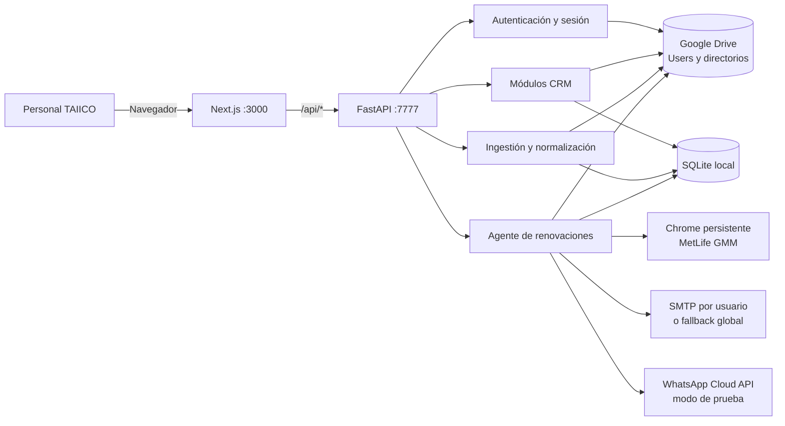
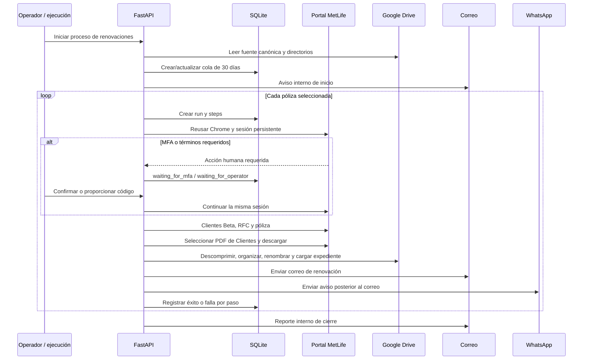

# Arquitectura actual de TAIICO CRM y TAIICO OS

**Estado documentado:** 18 de julio de 2026<br>
**Rama de referencia:** `taiico-os`

Este documento describe la arquitectura que existe hoy en el repositorio. No es una propuesta de migración a la nube. La especificación conceptual de largo plazo permanece en `TAIICO_OS_ARCHITECTURE.md`; cuando exista una diferencia, este archivo es la referencia para operar y desarrollar el sistema actual.

## 1. Resumen ejecutivo

TAIICO CRM y TAIICO OS comparten un solo repositorio y una sola instalación local en el Mac mini.

- **TAIICO CRM** es la interfaz que usa el personal para consultar y mantener clientes, cartera, cobranza, renovaciones, pendientes y configuración de correo.
- **TAIICO OS** es la capa operativa del mismo sistema: ingiere archivos, normaliza información, mantiene colas y auditoría, y ejecuta automatizaciones como la recuperación de renovaciones MetLife GMM.
- El frontend es una aplicación **Next.js 16 / React 19 / TypeScript** en el puerto `3000`.
- El backend es una API **FastAPI / Python** en el puerto `7777`.
- **Google Drive y sus carpetas adyacentes siguen siendo la fuente operacional canónica.** No se ha migrado la operación a Cloud SQL.
- **SQLite local** conserva estado técnico, índices normalizados, colas, ejecuciones y trazabilidad. No reemplaza a Drive como repositorio operacional.
- El sistema está diseñado para permanecer encendido en el Mac mini, aunque la ejecución diaria automática del agente todavía no está activada de forma permanente.

## 2. Vista general



## 3. Principios vigentes

1. **Drive primero.** Los libros y carpetas de Google Drive son las fuentes operativas que el personal puede seguir consultando y editando.
2. **Persistencia local complementaria.** SQLite guarda estado de aplicación, datos normalizados, procedencia, colas y auditoría; no obliga a rediseñar la operación existente.
3. **Cambios quirúrgicos.** CRM y agentes evolucionan en el mismo repositorio, pero cada cambio debe respetar los límites del módulo afectado.
4. **Automatización observable.** Las ingestiones y recuperaciones registran sus ejecuciones, pasos, resultados y errores.
5. **Humano en el circuito.** MFA, términos del portal, decisiones sensibles y fallas recuperables pueden requerir intervención humana.
6. **Comunicaciones protegidas.** El correo puede limitarse a destinatarios internos y WhatsApp opera con modo de prueba y lista permitida hasta completar la conexión productiva.
7. **Secretos fuera de Git.** Contraseñas, tokens, credenciales OAuth y llaves privadas viven en `backend/.env` o `local-secrets/`, ambos fuera del control de versiones.

## 4. Capas y responsabilidades

### 4.1 Frontend

La interfaz vive principalmente en `src/app`, `src/components` y `src/modules`.

- Next.js App Router sirve las pantallas del CRM.
- `src/middleware.ts` protege las rutas mediante la cookie `taiico_session` y redirige a `/login` cuando no existe sesión.
- El navegador consume rutas relativas `/api/*`.
- `next.config.ts` redirige esas solicitudes al backend en `http://127.0.0.1:7777`.
- Los módulos visibles incluyen inicio, clientes, cartera, cobranza, renovaciones, pendientes, dashboards y configuración de correo.

### 4.2 Backend

`backend/main.py` crea la aplicación FastAPI y monta los routers de cada dominio:

- `/cobranza`
- `/renovaciones`
- `/cartera`
- `/clientes`
- `/ingestion`
- `/drive-sources`
- `/renewal-ingestion`
- `/client-email-directory`
- `/whatsapp`
- `/pendientes`
- `/mail-configuration`

Además expone login, sesión, logout y un endpoint de salud básico.

### 4.3 Datos operativos en Google Drive

El backend accede a Drive de dos formas compatibles:

- **Carpetas sincronizadas localmente:** rutas hermanas del repositorio configuradas en `backend/config.py`, por ejemplo cobranza, cartera, fechas de renovación, correos de clientes y usuarios.
- **Google Drive API:** archivos y carpetas identificados mediante variables de entorno para escaneo, ingestión, autenticación, directorios y carga de expedientes.

Las credenciales de servicio u OAuth se cargan desde archivos locales protegidos. Los identificadores concretos de carpetas y archivos no deben documentarse en el repositorio.

### 4.4 Persistencia técnica local

SQLAlchemy usa por defecto `backend/taiico_local_fallback.db`. Alembic administra la evolución del esquema.

La base local contiene cuatro grupos principales:

| Grupo | Tablas principales | Propósito |
|---|---|---|
| CRM | `users`, `clients`, `insurers`, `products`, `policies`, `payments`, `renewals`, `claims` | Modelo normalizado de operación |
| Trabajo y gobierno | `tasks`, `conversations`, `agent_actions`, `escalations`, `human_approvals`, `candidates`, `strategy_proposals` | Seguimiento, auditoría y extensiones del OS |
| Ingestión | `source_documents`, `ingestion_runs`, `ingestion_records`, `payment_evidence_records`, `reconciliation_matches`, `data_quality_issues` | Procedencia, normalización y calidad de datos |
| Recuperación de documentos | `policy_document_retrieval_tasks`, `policy_document_retrieval_runs`, `policy_document_retrieval_steps` | Cola, ejecución y detalle de cada paso del agente |
| Configuración local | `user_mail_configurations` | Credenciales SMTP cifradas y verificadas por usuario |

Drive sigue siendo la fuente de trabajo. Estas tablas permiten búsqueda, trazabilidad y automatización sin mover la operación a una base remota.

## 5. Ingestión y procedencia

La ingestión separa el acceso a archivos de la interpretación de cada aseguradora.

1. `backend/drive` localiza y descarga fuentes autorizadas.
2. `backend/services/drive_sources.py` registra documentos y permite escanearlos o validarlos en seco.
3. Los parsers de `backend/parsers` interpretan los formatos conocidos de MetLife y SURA.
4. Los servicios de ingestión escriben registros normalizados con referencia al archivo, hoja, fila y versión del parser.
5. Los problemas de formato o calidad se conservan en `data_quality_issues` en vez de perderse silenciosamente.

Fuentes canónicas actualmente contempladas:

- Cobranza MetLife, SURA y AARCO.
- Cartera MetLife y SURA mediante carpetas sincronizadas.
- Renovaciones MetLife GMM, MetLife Vida, SURA, Promotoría SURA y AARCO/AXA.
- Directorio de clientes y correos, con RFC como identificador preferente cuando está disponible.
- Libros de pendientes de emisión/servicios y siniestros.

## 6. Autenticación, sesión y correo

### 6.1 Acceso al CRM

- Las credenciales de usuarios se leen de un workbook autorizado de Drive y se mantienen brevemente en caché.
- FastAPI valida el login y entrega una cookie firmada, HTTP-only y con expiración.
- Next.js comprueba la presencia de la cookie para proteger las pantallas.
- La sesión es local; no existe actualmente un proveedor de identidad centralizado.

### 6.2 Correo saliente

- Cada usuario puede registrar su propia cuenta SMTP desde el módulo de configuración.
- La contraseña SMTP se cifra antes de persistirse y puede verificarse antes de usarla.
- Si no existe configuración individual, el sistema puede usar las variables SMTP globales como fallback.
- En renovaciones, `RENEWAL_EMAIL_INTERNAL_ONLY` y la lista interna permiten impedir que una prueba contacte clientes reales.

## 7. Agente de renovaciones MetLife GMM

El flujo combina información de Drive, una cola local y automatización controlada del portal.



### 7.1 Selección de trabajo

- La vista de renovaciones consulta una ventana futura, normalmente de **30 días**.
- La ingestión crea o actualiza `policy_document_retrieval_tasks` sin duplicar filas equivalentes.
- RFC es la llave de enlace preferida entre renovación y cliente; número de póliza y nombre sirven como apoyo.

### 7.2 Sesión persistente del portal

- `backend/adapters/metlife_gmm_portal.py` usa Playwright conectado por CDP a Chrome en el puerto `9223`.
- El perfil se conserva fuera del repositorio, bajo el directorio de soporte de la aplicación en macOS.
- Chrome no se cierra al terminar una ejecución; cookies, aceptación de términos y sesión pueden reutilizarse.
- El adaptador entra a **Clientes Beta**, busca por RFC, valida la póliza y selecciona el tipo de PDF para clientes.

### 7.3 MFA y acciones humanas

- Si MetLife solicita un código, el run cambia a `waiting_for_mfa`.
- La sesión del navegador permanece abierta.
- El endpoint de continuación recibe el código o la confirmación del operador y reanuda el mismo run.
- El código MFA no se almacena.
- Todos los pasos, esperas y fallas se registran en las tablas de runs y steps.

### 7.4 Documentos y comunicaciones

- El ZIP descargado se valida y descomprime.
- Los CFDI y documentos de póliza se reúnen en una carpeta de renovación con nombre normalizado.
- La carpeta se carga al destino autorizado de Drive.
- El proceso envía un correo interno de inicio, un correo por renovación y un resumen interno final.
- El aviso de WhatsApp se ejecuta después del correo.

### 7.5 Estado de WhatsApp

La integración usa WhatsApp Cloud API con la plantilla `renewal_ready_test` en español de México.

- El código actual exige token, Phone Number ID, WABA ID y versión de API mediante variables de entorno.
- El modo de prueba obliga a que todos los destinatarios estén en una allowlist.
- Cada intento queda registrado como `agent_action`.
- La conexión del número empresarial con coexistencia de WhatsApp Business y Cloud API está pendiente de la revisión de Meta. Hasta completarla, este canal debe considerarse de prueba y no productivo.

## 8. Operación en el Mac mini

La instalación esperada usa:

- repositorio y `.venv` en la raíz del proyecto;
- intérprete `/usr/local/bin/python3`;
- FastAPI en `7777`;
- Next.js en `3000`;
- Chrome persistente para MetLife en `9223`;
- Google Drive para escritorio y acceso de API disponibles;
- secretos cargados desde `backend/.env` y `local-secrets/`.

El Mac mini debe permanecer encendido, sin suspensión que interrumpa Drive, Chrome o los procesos web. Actualmente las renovaciones pueden ejecutarse bajo demanda. La programación diaria a las 09:00 de Ciudad de México es una capacidad pendiente; no debe asumirse activa hasta instalar y verificar un servicio persistente de macOS.

## 9. Seguridad y controles

- Nunca se deben confirmar en Git `backend/.env`, tokens, contraseñas, App Passwords ni JSON de credenciales.
- Las credenciales SMTP persistidas se cifran con una llave local.
- Las credenciales del portal y de Meta se obtienen en tiempo de ejecución.
- Los códigos MFA no se guardan.
- Los runs y steps forman el rastro auditable de la automatización.
- Las pruebas de correo y WhatsApp deben mantener activas las restricciones internas hasta una autorización explícita de producción.
- Las carpetas de Drive y el portal deben conceder solamente los permisos necesarios.

## 10. Mapa del repositorio

```text
taiico-crm/
├── src/
│   ├── app/                 # páginas Next.js
│   ├── components/          # vistas y componentes reutilizables
│   ├── lib/                 # cliente API, tipos y utilidades
│   └── modules/             # servicios de dominio del frontend
├── backend/
│   ├── adapters/            # automatización de portales
│   ├── alembic/             # migraciones de SQLite
│   ├── drive/               # acceso y registro de fuentes Drive
│   ├── parsers/             # formatos por aseguradora
│   ├── services/            # routers y lógica de negocio
│   ├── tests/               # pruebas del backend
│   ├── config.py            # rutas y fuentes configurables
│   ├── database.py          # modelos SQLAlchemy
│   └── main.py              # aplicación FastAPI
├── local-secrets/           # credenciales locales ignoradas por Git
├── alembic.ini
├── next.config.ts
├── package.json
├── README.md
├── TAIICO_OS_ARCHITECTURE.md # visión conceptual de largo plazo
└── arquitectura.md           # arquitectura implementada actual
```

## 11. Límites actuales y próximos puntos de evolución

1. **Disponibilidad:** backend, frontend y Chrome todavía dependen de procesos locales; falta supervisión automática y reinicio ante fallas.
2. **Agenda diaria:** falta instalar y comprobar la ejecución a las 09:00 `America/Mexico_City`.
3. **WhatsApp productivo:** coexistencia y revisión de Meta siguen pendientes; el flujo actual es de prueba.
4. **Datos maestros:** la calidad del enlace por RFC, teléfono, correo y agente depende de completar los directorios canónicos.
5. **Autenticación:** el workbook de usuarios y la cookie local son suficientes para la instalación actual, pero no equivalen a SSO empresarial.
6. **Arquitectura futura:** cualquier migración a servicios administrados debe tratarse como proyecto separado y no sustituir Drive ni SQLite sin una decisión explícita.

## 12. Regla para mantener este documento

Actualizar `arquitectura.md` cuando cambie cualquiera de estos puntos:

- un servicio, puerto o proceso persistente;
- la fuente canónica de un dominio;
- el esquema de autenticación o secretos;
- el motor de persistencia;
- el flujo de renovaciones o sus canales de comunicación;
- el estado productivo de WhatsApp;
- la forma de desplegar o programar los agentes.

Los detalles operativos sensibles —IDs, teléfonos, correos de prueba, tokens, contraseñas y rutas privadas de perfiles— deben permanecer fuera de este documento.
